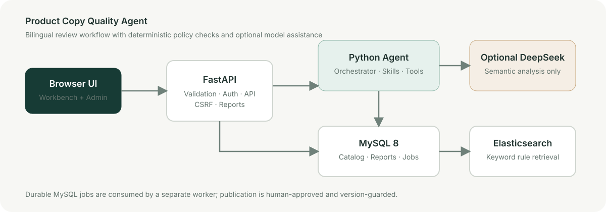

# 电商商品文案质检 Agent

[English](README.md) · [简体中文](README.zh-CN.md)

**LLM 主导文案审核，规则负责安全校验与降级兜底，发布决定可追溯。**



这是一个可运行的工程项目：支持中英文后台、DeepSeek 语义审核、独立 MySQL 数据库租户隔离、Redis Streams、并发质检、指标告警和审计发布。当前规则及样例以中文商品文案为主；界面切换不改变商品原文和证据。

## 启动与登录

```bash
test -f .env || cp .env.example .env
mkdir -p .local/runtime
docker compose up --build -d --wait
```

打开 http://127.0.0.1:8000/admin 。默认演示租户 `default`，账号 `admin`，密码 `admin12345`。登录后可使用首页质检工作台。MySQL 宿主机端口 3307、容器端口 3306；Redis 宿主机端口 6380、容器端口 6379。

商家端位于 http://127.0.0.1:8000/merchant。管理员登录后可调用 `POST /api/merchant/invite` 邀请商家账号；商家登录后可上传 CSV/JSON（最多 1000 条、10 MB），商品会归属该商家并进入待审核状态。管理员也可使用 `POST /api/admin/products/import` 上传 CSV，字段为 `product_id,merchant_name,category,title,description`。

在本地忽略的 `.env` 中配置 DeepSeek 密钥和可用模型名称。完整模式默认执行 LLM 语义审核，再合并不可被模型否决的规则检查。无密钥或模型异常时输出降级报告，不能作为完整模式的发布依据。显式规则模式用于离线基线与低成本负载验证。

## 本次工程能力

| 领域 | 实现 |
|---|---|
| 租户隔离 | 每个租户独立数据库、数据库账号、会话、商品、任务、报告及评测文件；旧数据保留在默认租户 |
| 任务中间件 | Redis Streams 投递，MySQL 任务条目作为可恢复的 outbox；承认至少一次投递 |
| 并发 | 独立商品租约、线程池、每个任务独立 Session、租户轮转调度、分布式模型并发限制 |
| 高峰保护 | 每租户待处理容量、HTTP 429、重试退避、租约恢复、失败任务手工重试 |
| 审核准确性 | 模型证据必须来自原文，规则编号/类型/风险等级必须匹配；确定性检查不可被模型覆盖 |
| 监控 | Prometheus 指标、Grafana 仪表盘、Alertmanager 和本地告警接收器 |
| 日志 | JSON 格式，包含请求/租户/任务标识、时延及错误类型；不输出密钥、SQL、商品全文或模型原始响应 |
| 数据生成 | 万条规模、分批投送、多租户、可复现种子、限速和并发；支持数据库或认证 API 投送 |

管理后台的批量质检走异步任务；浏览器显示进度。质检结束后仍需复核当前报告，再执行批量审核发布。发布只更新本项目状态，尚未对接淘宝、京东等真实平台。

## 万条数据生成

离线生成 12,000 条 JSONL：

```bash
python -m scripts.generate_load --count 12000 --tenants default,merchant-east,merchant-west \
  --delivery export --output simulation-output/load.jsonl
```

租户已创建后，导入数据库：

```bash
python -m scripts.generate_load --count 12000 --tenants default,merchant-east,merchant-west \
  --delivery database --concurrency 4 --requests-per-second 4 --batch-id scale-demo
```

每次最多投送 100 条；默认不调用模型、不自动发布。加 `--inspect` 进入规则基线队列。真实 HTTP 模拟使用 `--delivery api --clients-file .local/load-clients.json`。同一计划可断点重跑；更改种子、分块或场景请更换批次标识。

新租户由运维脚本 `scripts.provision_tenant` 创建，管理密码只保留哈希；数据库连接注册表只放在本地忽略目录。详见[部署、租户与并发说明](docs/platform-operations.md)。

## 监控与测试

```bash
docker compose -f compose.yaml -f compose.monitoring.yaml up -d --build
python -m pip install -r requirements-dev.txt
DEEPSEEK_API_KEY='' python -m pytest -q
npm ci --ignore-scripts
npm test
```

Grafana 为 http://127.0.0.1:3000 ，本地演示账号 `admin / local-grafana-change-me`；Prometheus 为 9090 端口，Alertmanager 为 9093 端口。告警默认进入本地 JSON 接收日志，外部值班通知需要部署者配置。SLO 是目标，不是已达成的 SLA。

MySQL 集成测试应使用独立测试库，并设置 `RUN_MYSQL_TESTS=1`；租户数据库权限测试还需测试环境的 `MYSQL_ADMIN_URL`。CI 不需要模型密钥。

[运行验证记录](docs/platform-validation.md) · [SLO 与告警](docs/slo.md) · [英文项目说明](README.md)

## 能力边界

Agent 使用自定义 Python Orchestrator / State / Skill / Tool，不是 LangGraph 或 LangChain，也不是模型训练项目。目前无需同时增加 Kafka、RabbitMQ 或 Kubernetes；先用一套可验证的中间件完成闭环。

生产接入仍需平台适配器、SSO/RBAC、真实业务标注、密钥托管、基础设施高可用及持续压测。不能承诺零误判或未经测量的峰值 QPS。仓库禁止上传密钥、真实数据导出和内部进度计划。
