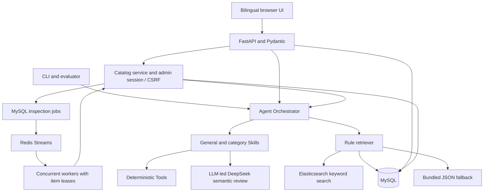

# Architecture and implementation

> Version 2 update: the [current platform guide](platform-operations.md) supersedes earlier single-tenant/public-API examples in this document. Current behavior uses LLM-led full-mode review, database-per-tenant isolation, authenticated data routes, Redis Streams, concurrent workers, JSON logs and [metrics/SLOs](slo.md). Historical roadmap items for these capabilities are now implemented; live marketplace integration and production HA remain future work.

[Documentation index](README.md) · [中文项目说明](../README.zh-CN.md)

## Design approach

1. Define validated product inputs, issue evidence and report schemas before implementing checks.
2. Keep deterministic checks in Tools; combine related checks in Skills with a shared result contract.
3. Use a Python Orchestrator to maintain per-request State, choose the category and run a fixed sequence with conditional model calls.
4. Retrieve applicable rule evidence, validate model findings and retain rule results when external capabilities fail.
5. Persist input, result and trace; associate administrator inspections with an immutable product revision.
6. Add durable inspection jobs and transactional publication guards around the same inspection engine.
7. Exercise the workflow with synthetic submissions, engineering tests and a fixed evaluation dataset.

The Agent is custom Python orchestration. It has no LangChain/LangGraph dependency, open-ended planning loop, model-directed tool execution or training pipeline.

## Components

## Inspection flow

Input validation → supplied/inferred category → relevant and applicable rules → LLM semantic review of original copy → mandatory general and category safeguards → issue merging and scoring → conservative rewrite → summary and report validation → result/trace persistence. Explicit rules-only mode skips the model stage and is labelled accordingly.

State stores the normalized product, mode, category, rules, issues, score, suggestions, warnings, errors and trace events. Each Skill receives an isolated context copy; validated outputs are merged back into State. A Tool performs one check, a Skill groups business behavior, and the Orchestrator controls order and aggregation.

The score is a risk sum: high issues contribute 5, medium 3 and low 1. A total of 0 is pass, 1–2 low, 3–4 medium and 5+ high. This is not a percentage quality score. Report execution status and risk level are separate: successful execution can identify high risk.

## Module map

| Path | Responsibility |
|---|---|
| `app/schemas.py`, `app/catalog_schemas.py` | Product, report and administrator request validation |
| `app/main.py` | Workbench, inspection, results, traces, evaluation and health routes |
| `app/admin.py`, `app/admin_auth.py`, `app/simulation.py` | Catalog, session/CSRF and simulation routes |
| `app/static/` | Plain HTML/CSS/JS, explicit translation dictionaries and select controls |
| `agent/orchestrator.py` | State, routing, sequencing, failure isolation, merging and evidence binding |
| `skills/` | General/category checks, semantic validation and conservative suggestions |
| `tools/` | Deterministic title, claim, attribute and consistency checks |
| `rag/` | Rule validation, keyword retrieval and fallback |
| `llm/client.py` | DeepSeek HTTP, bounded retries, strict JSON and sanitized failures |
| `services/catalog.py` | Revisions, inspection lifecycle, publication guards and audit records |
| `services/jobs.py`, `scripts/worker.py` | Durable job claiming, leases, heartbeats, cancellation and retries |
| `services/simulation.py` | Deterministic synthetic inputs and conflict-aware delivery |
| `db/` | MySQL ORM, repositories and limited additive migration hooks |
| `evaluator/`, `tests/` | Detection evaluation and software behavior tests |

## Failure handling and concurrency

Retrieval tries Elasticsearch, then MySQL, then bundled JSON on failure. A successful empty response is authoritative: it does not reactivate disabled JSON rules. Rule text supplies evidence and semantic guidance; inserting a rule does not implement a new Python detector.

Missing keys, timeouts, invalid JSON and unsupported citations leave deterministic findings intact and record limited coverage. The model may infer a missing category and inspect semantics in full mode. Copy and summary model echo calls are disabled by default; deterministic suggestions remove risky clauses without inventing missing facts.

A required deterministic Skill failure produces a partial report for review. Trace events record measured calls, summaries, status and duration, not hidden model reasoning. The API saves results and trace events in one transaction; failures roll back that transaction before saving failure information.

Synchronous routes occupy an HTTP request until completion. Durable jobs run in a separate worker, with MySQL leases, heartbeat renewal, bounded attempts and version checks. This is not a claim of nonblocking I/O throughout the service or exactly-once external model calls. Evaluation uses a process-local lock, not a distributed scheduler.

Editing creates a revision and invalidates old inspection evidence. Starting a new inspection on a published product returns it to pending. Late results cannot replace evidence for a newer revision or a later inspection. Publication revalidates the current version and complete report under row locks and rejects high risk or invalid evidence.

Batch publication previews up to 20 products. Confirmed items publish in independent transactions and receive individual audit entries; conflicts can produce partial success. There is no automatic retry or durable publication job. See the [administrator guide](admin.md) for the user flow.

## Operational boundary

Each tenant has a separate database/user and one administrator identity with expiring sessions. Authentication establishes database routing before request threads start. Redis controls distributed login failure windows, model concurrency and per-HTTP-attempt rate limits. SQL admission enforces tenant pending capacity. Metrics, JSON logs, dashboards and SLO alert rules are included. There is no multi-role model, complete versioned migration framework, HA validation or marketplace publishing integration. See [platform operations](platform-operations.md) for the current deployment contracts.
